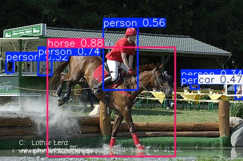

# Event-Driven Image Annotation and Retrieval System

An event-driven image-processing system for image upload, object detection, document storage, embedding-based retrieval, and asynchronous querying.

This project is built around a **pub-sub architecture**. Services do not call each other directly. Instead, they communicate by publishing and consuming events through **Redis**. This keeps the system modular, easier to test, and closer to a realistic distributed design. The pipeline supports both a **mock mode** for architecture and messaging validation, and a **real mode** that uses **YOLO** for object detection, **CLIP** for embeddings, **FAISS** for vector retrieval, and **MongoDB** as a true document database.

In the real pipeline, when a user uploads an image, the CLI publishes an `image.submitted` event. The inference service consumes that event, runs object detection, saves an annotated image with bounding boxes, generates embeddings for the full image and detected object crops, indexes those vectors in FAISS, and publishes follow-up events. The document database service stores one nested document per image in MongoDB, while the query service handles text and image retrieval asynchronously. This means uploads, indexing, document storage, and querying can happen independently without one step tightly blocking the others.

---

## Features

- Event-driven architecture using Redis pub-sub
- Asynchronous service communication
- Mock mode for fast architecture and testing workflows
- Real mode with:
  - YOLO object detection
  - annotated image generation
  - CLIP multimodal embeddings
  - FAISS similarity search
  - MongoDB document storage
- Text-to-image retrieval
- Image-to-image retrieval
- Unit and integration tests with pytest

---

## Project Structure

```text
event-driven-image-annotation-system/
├── src/
│   ├── main.py
│   ├── event_generator.py
│   ├── messaging/
│   │   ├── __init__.py
│   │   ├── topics.py
│   │   ├── events.py
│   │   └── redis_broker.py
│   ├── services/
│   │   ├── __init__.py
│   │   ├── cli_service.py
│   │   ├── inference_service.py
│   │   ├── document_db_service.py
│   │   ├── embedding_service.py
│   │   └── query_service.py
│   ├── retrieval/
│   │   ├── __init__.py
│   │   └── real_pipeline.py
│   └── storage/
│       ├── __init__.py
│       └── mongo_document_store.py
├── tests/
│   ├── __init__.py
│   ├── conftest.py
│   ├── helpers.py
│   ├── test_events.py
│   ├── test_redis_broker.py
│   ├── test_cli_service.py
│   ├── test_inference_service.py
│   ├── test_document_db_service.py
│   ├── test_embedding_service.py
│   ├── test_query_service.py
│   ├── test_integration_pipeline.py
│   ├── test_integration_flow_100_images.py
│   └── test_failure_modes.py
├── images/
│   └── car_001.jpg
├── assets/
│   └── img_6736d07d_annotated.jpg
├── artifacts/
│   ├── annotated/
│   └── faiss/
├── requirements.txt
├── pytest.ini
└── README.md
```

---

## Messaging and Pipeline Overview

The system uses **Redis** as the message broker. Each service publishes and subscribes to topics instead of invoking other services directly. This keeps the pipeline loosely coupled and naturally asynchronous. The main topics are:

- `image.submitted`
- `inference.completed`
- `image.indexed`
- `annotation.stored`
- `query.submitted`
- `query.completed`

A typical upload flow is:

1. CLI publishes `image.submitted`
2. Inference service consumes the event
3. YOLO detects objects and predicts bounding boxes
4. An annotated image is saved
5. CLIP embeddings are created for the full image and detected object crops
6. FAISS indexes the vectors
7. Document DB service stores the nested annotation document in MongoDB
8. `image.indexed` is published to signal that the image is searchable

A typical query flow is:

1. CLI publishes `query.submitted`
2. Query service consumes the event
3. In real mode:
   - text query -> CLIP text embedding -> FAISS search
   - image query -> CLIP image embedding -> FAISS search
4. Query service publishes `query.completed`
5. CLI prints the ranked results

---

## Mock Mode vs Real Mode

### Mock Mode

Mock mode is used to test the architecture, event flow, and service boundaries without running the full retrieval stack. In this mode, services produce simulated outputs instead of running actual YOLO, CLIP, FAISS, or MongoDB-heavy workflows. It is useful for:

- validating event flow
- testing Redis topics and message contracts
- debugging service boundaries
- running lightweight local tests

Run mock mode:

```bash
PYTHONPATH=src python src/main.py --mode interactive
```

There is also a demo mode that publishes generated events automatically:

```bash
PYTHONPATH=src python src/main.py --mode demo
```

### Real Mode

Real mode runs the actual annotation and retrieval pipeline.

In this mode:

- **YOLO** performs object detection and creates the annotated image
- **CLIP** generates embeddings for text, full images, and object crops
- **FAISS** stores embeddings and performs similarity search
- **MongoDB** stores one nested document per image
- **Redis** coordinates the services asynchronously

Run real mode:

```bash
PYTHONPATH=src python src/main.py --mode real
```

Before running real mode, make sure Redis and MongoDB are running.

---

## Technologies Used

### Redis
Redis is used as the pub-sub broker. Services communicate by publishing and subscribing to topics.

### YOLO
YOLO is used for object detection. It finds objects, predicts bounding boxes, assigns labels, and produces the annotated image.

### CLIP
CLIP is used to generate embeddings for both text and images. This makes it possible to compare text queries and image queries in a shared semantic space.

### FAISS
FAISS is used for vector indexing and nearest-neighbor search. It stores image and object embeddings and returns the most similar matches during retrieval.

### MongoDB
MongoDB is used as the document database. Each uploaded image is stored as a nested document containing metadata, annotation results, object lists, status, and history.

---

## Example Annotated Output

Below is an example annotated image produced by the inference pipeline. The boxes and labels are generated by **YOLO**.




---

## Dataset Used

This project was tested using the **PASCAL VOC 2012** dataset.

It is a standard object-detection dataset containing everyday categories such as:

- person
- car
- dog
- horse
- chair
- tv/monitor

It is a good fit for this project because it provides realistic object-centric images and common visual categories that work well for both detection and retrieval experiments.

---

## Installation

Install dependencies:

```bash
pip install -r requirements.txt
```

If needed, also install explicitly:

```bash
pip install pymongo redis torch torchvision transformers ultralytics faiss-cpu pillow numpy pytest
```

---

## Running the System

### Start Redis

```bash
redis-server
```

### Start MongoDB

If MongoDB is installed manually:

```bash
mongod
```

If MongoDB runs as a service on your system:

```bash
sudo systemctl start mongod
```

### Run mock mode

```bash
PYTHONPATH=src python src/main.py --mode interactive
```

### Run demo mode

```bash
PYTHONPATH=src python src/main.py --mode demo
```

### Run real mode

```bash
PYTHONPATH=src python src/main.py --mode real
```

---

## How to Use Real Mode

1. Upload one or more images
2. Wait until the system prints the `[READY]` message
3. Run a text query such as:
   - `horse`
   - `tv`
   - `car`
   - `person`
4. Or run an image query using another image path
5. Check:
   - FAISS stats
   - MongoDB stats
   - annotated image files in `artifacts/annotated/`

---

## Output Artifacts

The real pipeline saves:

- annotated images in `artifacts/annotated/`
- FAISS index and metadata in `artifacts/faiss/`

MongoDB stores the nested annotation documents separately.

---

## Testing

The project includes both **unit tests** and **integration tests**.

### Unit Tests

Unit tests verify the logic of individual modules, including:

- event construction and validation
- Redis broker behavior
- CLI publishing logic
- inference service behavior
- document database storage logic
- query service behavior
- failure handling

### Integration Tests

Integration tests verify the full event-driven flow across services. These tests check that messages are published and consumed correctly, that documents are stored, and that retrieval results propagate through the system properly.

There is also a larger integration-style test that simulates a heavier flow with many images to verify that the asynchronous design remains correct under load.

Run all tests:

```bash
PYTHONPATH=src pytest
```

Run only unit tests:

```bash
PYTHONPATH=src pytest -m "not integration"
```

Run only integration tests:

```bash
PYTHONPATH=src pytest -m integration
```

---

## What the Tests Validate Overall

At a high level, the test suite checks four things:

1. **Correct messaging behavior**  
   Events have the right structure, and services publish/subscribe to the correct topics.

2. **Correct pipeline behavior**  
   Uploaded images are processed, stored, indexed, and made searchable.

3. **Correct storage behavior**  
   MongoDB stores the right nested document structure for each image and its detected objects.

4. **Correct robustness behavior**  
   The system handles invalid inputs, failures, and asynchronous timing issues without collapsing.

---

## Notes

- **YOLO** performs annotation and box drawing.
- **FAISS** performs retrieval, not annotation.
- **MongoDB** stores documents, not vectors.
- The system is eventually consistent by design, so an uploaded image becomes searchable only after indexing finishes and the ready event is published.